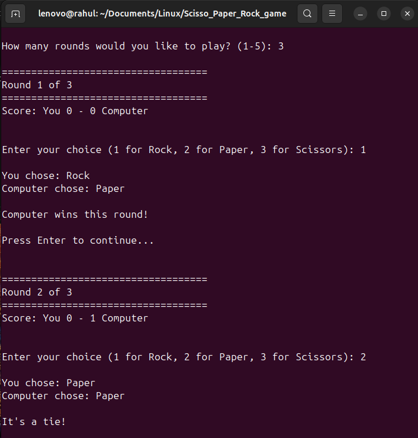
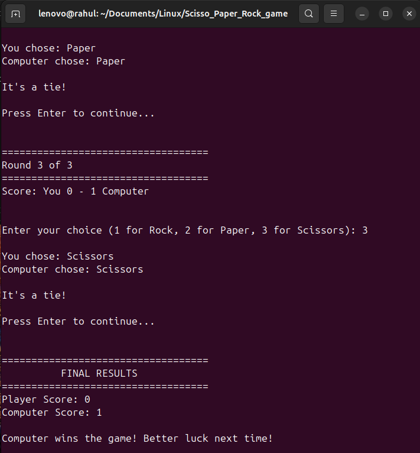
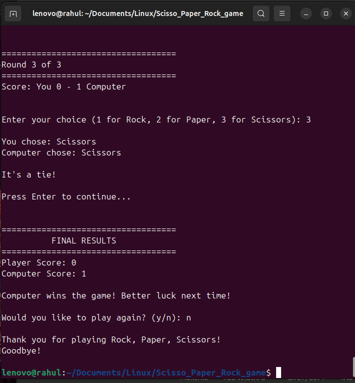

# 🪨📄✂️ Scisso Paper Rock Game

[](#)
[](LICENSE)
[](#)

An interactive **Rock–Paper–Scissors** terminal game written in C, designed to demonstrate modular programming, simple UI logic, and testable architecture.

---

## 🚀 Features

- 🎮 Classic Rock–Paper–Scissors gameplay
- 🧩 Modular code (`.c` + `.h` files)
- 🧪 Basic unit tests included
- 🛠️ Clean `Makefile` with `run`, `test`, `clean` targets
- 💻 Terminal-based UI
- ✅ Easy to compile and run

---

## 📸 Screenshot

Here’s what the game looks like when played:






---

## 🎥 Live Demo
Watch the game in action! 🎬


---

## 📂 Project Structure

Scisso_Paper_Rock_game/
├── 📁 assets/              # 🖼️ Screenshots, GIFs
│   ├── game_demo.gif
│   ├── rock_game1.png
│   ├── rock_game2.png
│   ├── rock_game3.png
│   └── rock_game4.png
├── 📁 build/               # 🔧 Compiled objects & binaries
│   ├── *.o
│   └── rock_paper_scissors, test_logic
├── 📁 include/             # 📋 Header files
│   ├── display.h
│   ├── game_logic.h
│   └── input_handler.h
├── 📁 src/                 # 💻 Source files
│   ├── display.c
│   ├── game_logic.c
│   ├── input_handler.c
│   ├── test_logic.c
│   └── main.c
├── Makefile                # ⚙️ Build automation
├── README.md               # 📖 Project overview
└── .gitignore             # 🚫 Git exclusions

---

---

## 🏃‍♂️ Quick Start

### 🛠️ Prerequisites
- GCC compiler installed 📦
- Make utility available ⚡
- Linux/Unix terminal 🐧

### ⚙️ Build & Run Commands
```bash
# 🧹 Clean previous builds
make clean

# 🔨 Compile the project
make

# 🎮 Run the game
make run

# 🧪 Run tests (optional)
make test

---

🎯 How to Play

🚀 Run the game using make run
🎮 Choose your move: Rock (R), Paper (P), or Scissors (S)
🤖 Computer makes its choice
🏆 Winner is determined based on classic rules
🔄 Play again or quit anytime!

---

🧪 Testing
Run the included unit tests to verify game logic: ✅

📜 License
This project is open-source and available under the MIT License.

🙌 Acknowledgements

Built with ❤️ in a Linux terminal
Designed for learning C programming and having fun! 🎉
Perfect for demonstrating clean code practices 💡

